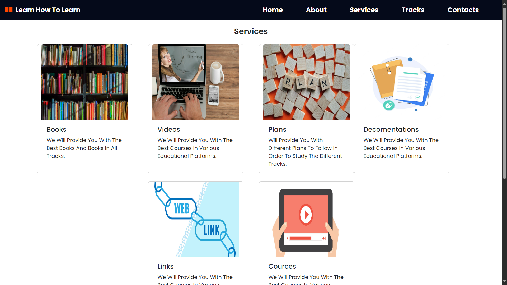
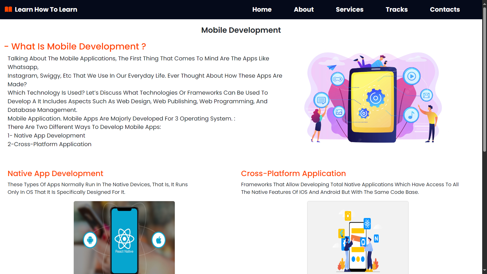
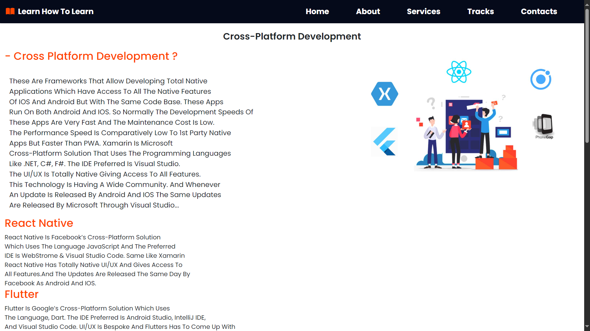
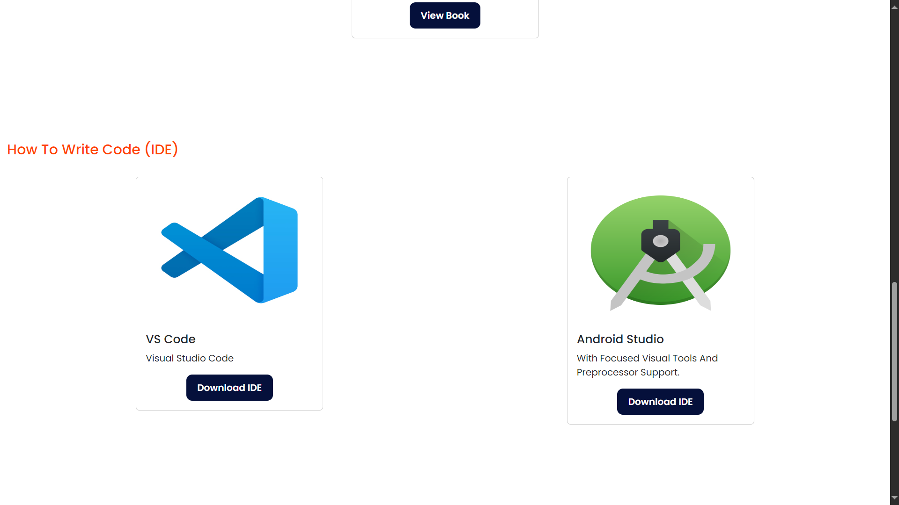

<p align="center">
  
</p>

# Learn How To Learn

## Content
 - [Description](#description)
 - [Features](#features)
 - [Tools](#tools)
 - [Screenshots](#screenshots)


# Description

Learn How to Learn is a website designed to help programmers enhance their skills from basic to advanced levels. 
Whether you're just starting out or looking to deepen your knowledge, this resource offers a curated selection
of top courses, books, and projects for various programming tracks.


## Features

- Comprehensive Learning Tracks: Structured paths for various programming levels, from beginner to advanced.
- Top Courses: Handpicked courses to guide your learning journey.
- Recommended Books: Essential readings for each track to reinforce and expand your knowledge.
-Project Ideas: Practical projects to apply your skills and build your portfolio.


## Tools


# Screenshots










## Open Project

To open this project run this command in git bash

```bash
 git clone https://github.com/GeorgeEsbergen/learn-how-to-learn.git
```
